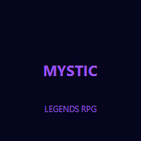

# MysticLegends RPG — Character Builds & Walkthrough



## Overview

Complete character build guide and story walkthrough for MysticLegends RPG. Covers all classes, talent trees, equipment sets, and endgame content strategies.

## Class Tier List (Patch 3.8)

| Tier | Class | Rating | Notes |
|------|-------|--------|-------|
| S | Chronomancer | 9.5/10 | Time manipulation dominates PvP |
| S | Shadowblade | 9.2/10 | Highest single-target burst |
| A | Paladin | 8.8/10 | Unmatched survivability |
| A | Runecaster | 8.7/10 | AoE destruction |
| B | Beastmaster | 8.2/10 | Solo farm champion |
| B | Battle Mage | 7.9/10 | Fun but suboptimal |
| C | Cleric | 7.5/10 | Utility, low DPS |
| D | Bard | 6.8/10 | Support only |

## S-Tier Build: Chronomancer

### Talent Tree (60 points)
```
Time Mastery: 20
  - Temporal Flux: +15% spell haste
  - Time Walk: 30% dodge chance
  - Rewind: Reroll failed saves (3x/day)

Arcane Synergy: 25
  - Spell Echo: 25% chance to cast twice
  - Mana Timestream: -30% mana cost
  - Reality Break: AoE burst (2min CD)

Chronosphere: 15
  - Freeze Field: 8s AoE stun
  - Age Acceleration: -50% enemy defense
  - Loop: Ultimate, 200% damage amplification
```

### Stat Priority
1. Intelligence (spell power)
2. Haste (faster casts)
3. Critical (higher burst)
4. Mastery (bonus effects)

### Best-in-Slot Equipment

| Slot | Item | Source |
|------|------|--------|
| Helm | Crown of Temporal Flow | Time Rift Dungeon |
| Chest | Chrono Vestments | Crafted: Temporal Silk |
| Weapon | Wand of Infinite Loops | Dragon Lich (Mythic) |
| Ring | Band of Causality | World Boss: Chaos Titan |
| Trinket | Hourglass of Eternity | Raid: Clockwork Fortress |

## Main Story Walkthrough

### Chapter 1: Awakening
- Quest: The Old Library → Ancient Runes → First Familiar
- Boss: Librarian Geist (weak to Fire)
- Reward: Apprentice Robe Set

### Chapter 2: The Three Factions
- Join one of three factions (choice affects story)
- Faction Quests unlock at Level 20
- Rep farming guide in `/guides/faction-rep.md`

## Endgame Raids

### Clockwork Fortress (Mythic)
- **Bosses**: 7 encounters
- **Minimum iLvl**: 485
- **Loot Table**: Temporal Set (Tier 20)
- **Strategy Guide**: `raids/clockwork_fortress.md`

## License

MIT License
